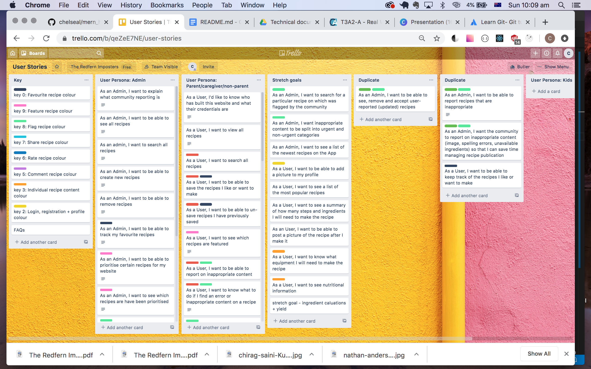
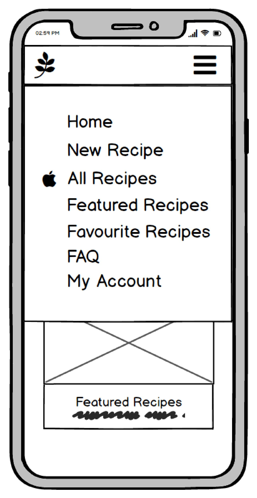
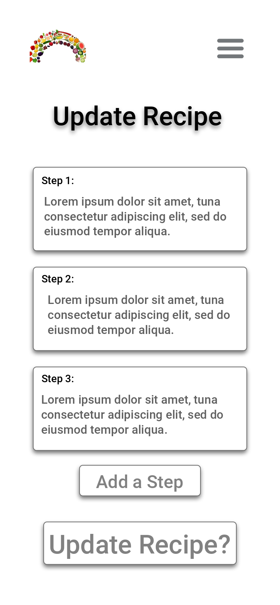

## MERN Project (Part A) T3A2 
### *Project planning, design + architecture*

##### Project collaborators:
- Chelsea Love
- Dale Thompson
- Harry Frankel

------

#### Purpose
The purpose of the Healthy Recipes web application is to empower parents to cook quick, healthy meals for their children.

The client's business aim is to build a community around wellness and healthy eating. The web application will become her online community, building on face-to-face wellness programs she currently runs. 

Future iterations of the website will cater to recipes children can make.

#### Functionality / features
1. **Admin dashboard** - the client can manage community flagged recipes and feature recipes.
2. **Community flagging of content** - as a community, users are responible for flagging inappropriate content through a form. This form is sent to the recipe author who can update or reject recipe content suggestions, and the the admin can see this process in her dashboard.
3. **Auth0 authentication and authorisation** - easy for users to manage their password, provides a high level of security for the user.
4. **Favourite a recipe** - users can easily return to their favourite recipes.
5. **Share a recipe** - admin can cross-promote website recipes to her business social media profiles, users can share recipes they like with their social network.
6. **Rate a recipe** - a counting system based off how many "yums" (likes) users have attributed to the recipe. The applaud rating system was chosen over a standard 5 star rating system.
7. **Comment on a recipe** - the community can share their experiences making the recipe.

#### Target audience

#### Tech stack

##### Front-end:
- HTML, CSS/SASS
- React - JavaScript library for building user interfaces
- Redux - JavaScript library for managing application state

##### Back-end:
- NodeJS - JavaScript runtime environment
- Express - web application framework for NodeJS

##### Cloud:
- Heroku - cloud deployment platform
- Amazon S3 - object storage service
- MongoDB Atlas - cloud database

##### Third party/other:
- Auth0 - authentication and authorisation for web applications
- Middleware

------

#### Dataflow Diagram

#### Application Architecture Diagram

#### UX/UI design documentation

Documenting the evolution of user stories

##### Brain storming user stories

##### Simplifying user personas

##### Removing duplicate user stories

##### Scrum Poker: Estimating User Story priority and complexity

1. Grab a set of scrum poker cards
2. Each player receives card values of 1, 2, 3, 5, 8, 13, 21 and a break card
3. The project lead reads out a user story
4. Each team member votes on story priority then story complexity
5. The lowest and highest card value holders explain why they chose their numbers
6. The team members can change their vote, card numbers are totalled and divided by the number of team members
7. This number is recorded on the user story and plotted on a grid to determine which tasks should be completed first, second and last
8. User stories are delegated to team members based on their placement on the grid below

##### Adding scrum values to user stories during scrum poker

##### Final User Stories organised by app features

#### Wireframes & Mockups

- *Wireframes were created with Balsamiq*
- *Mockups were created with Adobe XD*

[Navigatable Desktop Mockup](https://xd.adobe.com/view/caa39ebc-0746-4846-530d-b68a07023d3e-bc92/?fullscreen&hints=off)
[Navigatable Mobile Mockup](https://xd.adobe.com/view/f49a4364-4b14-4a2a-58aa-d1160b0f5e65-82ab/?fullscreen&hints=off)
[Homepage](#homepage)
[Menu](#menu)
[Login & register](#login)
[My account](#account)
[User dashboard](#user)
[Create recipe](#create)
[Update recipe](#update)
[Individual recipe](#recipe)
[All recipes](#all)
[Favourite recipes](#favourite)
[Featured recipes](#feature)
[Admin dashboard](#admin)
[Admin page for flagged recipes](#content)
[Users flagging recipes](#flagged)
[FAQs page](#faqs)
[Kids corner holding page](#kids)

##  Homepage

------

##  Menu
*Navigation bar on desktop as seen in above mockup*

------

##  Login & register

------

##  My account

------

##  User dashboard

------

##  Create recipe

------

##  Update recipe

------

##  Individual recipe

------

##  All recipes

------

##  Favourite recipes

------

##  Featured recipes

------

##  Admin dashboard

------

##  Admin page for flagged recipes

------

##  Users flagging recipes

------

##  FAQs page

------

##  Kids corner holding page

------

#### Project planning

The project uses a Kanban-style software tool - Trello - to plan, execute and track tasks. The project breaks up tasks by board, list and card. The different project phases were represented on separate Trello boards (below).

Example of project client board to manage team communication:

------